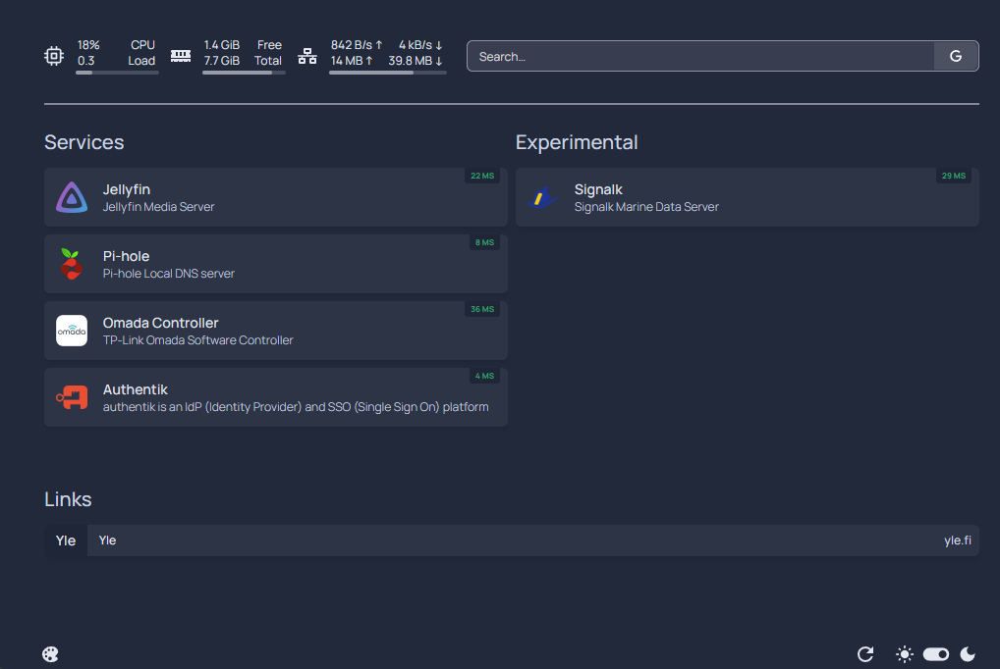

# 🏠Homelab

## 📘 Introduction

This repository contains the configuration of my Kubernetes-based homelab.  
The main purpose of this setup is to learn and practice modern cloud-native technologies and GitOps practices in a production-like environment while also running a few always-on applications.

The platform consists of a Kubernetes cluster running on a local single-node Talos installation together with supporting infrastructure managed in Azure. All infrastructure, platform components, and applications are defined declaratively in this repository and managed using Infrastructure as Code and GitOps practices.

Kubernetes resources are reconciled by FluxCD, while cloud resources are provisioned separately using Terraform. The repository contains configurations for two environments: **Production** (`home-prod`) and **Development** (`home-dev`).

**Please note:**
- Sensitive values (IPs, domains, emails) are sanitized before publishing. See [Sanitization](#sanitization) chapter for details.
- This repository is specific to my homelab setup and not a ready-to-use template. If you would like to build something similar, see [Deployment Notes](#deployment-notes).

## ⚙️ Design Principles

The design philosophy and goals for this homelab.

- **GitOps first**: Git is the single source of truth for both infrastructure and application configurations. FluxCD keeps the cluster state in sync with this repository.
- **Infrastructure as Code**: Cloud infrastructure and platform dependencies are managed declaratively using Terraform.
- **Modularity**: Separation between infrastructure, applications, and cluster definitions.
- **Environment overlays**: Multiple environments (dev, prod) are handled with Kustomize overlays, avoiding duplication of base manifests.
- **Secrets management**: No secrets in Git. Sensitive data is handled with SOPS and [External Secrets Operator](https://external-secrets.io/) (Azure Key Vault).
- **Production practices**: Adopts patterns suitable for real corporate environments.
- **Avoid vendor lock-in**: Use modular designs and decouple components so switching tools is possible.
- **Kubernetes-native**: Prefer Kubernetes and cloud-native APIs over custom tooling. For example, use [Gateway API](https://gateway-api.sigs.k8s.io/) to define and control inbound traffic centrally.
- **TLS everywhere**: Use real X.509 certificates issued through [cert-manager](https://cert-manager.io/) and terminated by [Kong Gateway](https://konghq.com/).  
- **Bootstrap automation**: New clusters can be bootstrapped quickly with scripts provided in `bootstrap/`.
- **Layered structure**: CRDs, controllers, configs, and applications are separated into their own kustomizations.
- **Single node cluster**: One node is reliable enough for my use case and with GitOps, replacing hardware or rebuilding the cluster is fast enough. A multi-node cluster with distributed storage (like Longhorn) would be nice, but for current needs it would be overkill and expensive.
  

## 🛠️ Technology Stack 

This homelab is built on two main layers: **platform components** that provide the foundation, and **applications** that run on top of it.

### Kubernetes Platform Components
Core components that make the cluster run and provide the services needed to deploy and manage applications.

| Logo | Name | Capability / Role in this homelab |
|------|------|-------------| 
|  | [Talos](https://talos.dev) | Immutable, secure-by-default Kubernetes operating system. |
|  | [Flannel](https://github.com/flannel-io/flannel) | CNI plugin providing basic pod networking across the cluster. |
|  | [FluxCD](https://fluxcd.io/) | GitOps controller that reconciles the desired cluster state from this repository. |  
|  | [cert-manager](https://cert-manager.io/) | Automates TLS certificate issuance and renewal, including Let’s Encrypt certificates via Cloudflare DNS validation.|  
|  | [External Secrets Operator](https://external-secrets.io/) | Synchronizes selected secrets from Azure Key Vault into Kubernetes Secrets. |
|  | [SOPS](https://getsops.io/) | Encrypts and manages secrets and sensitive configuration data stored in Git. |
|  | [Kong Gateway](https://konghq.com/) | API Gateway configured via Gateway API resources using [Kong Ingress Controller](https://konghq.com/products/kong-ingress-controller).|  
|  | [MetalLB](https://metallb.universe.tf/) | LoadBalancer implementation for bare-metal Kubernetes clusters. |
|  | [CloudNativePG](https://cloudnative-pg.io/) | PostgreSQL operator manages database cluster lifecycle and automates backups to Azure Blob Storage via [Barman Cloud](https://cloudnative-pg.io/plugin-barman-cloud/). |
|  | [Grafana K8s Monitoring](https://github.com/grafana/k8s-monitoring-helm) | Helm chart (v4) deploying Grafana Alloy via the Alloy Operator to collect cluster metrics, logs, and traces — forwarded to [Grafana Cloud](https://grafana.com/products/cloud) |
<!--|  | [K3s](https://k3s.io/) | Lightweight Kubernetes distribution. | -->

### Applications
Core services and experimental workloads deployed in the cluster.
| Name                                          | Description                                       |
| ------------------------------------------------- | ------------------------------------------------- |
| **[Authentik](https://goauthentik.io/)**     | IdP (Identity Provider) and SSO platform (system service).   |
| **[Pi-hole](https://pi-hole.net/)**          | Network-wide ad blocking and local DNS resolver.      |
| **[Homepage](https://gethomepage.dev/)**     | Unified dashboard for services and bookmarks.    |
| **[Jellyfin](https://jellyfin.org/)**        | Media system and streaming server.                           |
| **[Omada Software Controller](https://www.omadanetworks.com/en/business-networking/omada/controller/)** | Software controller for TP-Link SDN.                    |
| **[SignalK](https://signalk.org/)**          | Open-source marine data platform for aggregating boat sensor data.  |

### Repository Automation and Validation 
Automation and validation tools used outside the cluster to keep the repository safer, more reliable, and up to date.

| Tool | Role in this homelab |
|---|---|
| [GitHub Actions](https://github.com/features/actions) | Runs repository validation workflows such as GitOps checks and secret scanning. |
| [Gitleaks](https://gitleaks.io/) | Scans the repository for accidentally committed secrets. |
| [Renovate](https://docs.renovatebot.com/) | Monitors dependencies and container image versions, then creates pull requests for updates. |
| [git-filter-repo](https://github.com/newren/git-filter-repo) | Used to sanitize the repository before pushing it to public mirror. |

### 💻 Infrastructure
The platform consists of a local single node Kubernetes cluster running on Talos Linux paired with cloud resources provisioned in Azure using Terraform.

**Cloud Infrastructure Automation**:
 **[Terraform](https://terraform.io/)** is used to declaratively provision external Azure resources (Storage Account, Key Vault, and Entra ID application registrations) required by cluster workloads.

**Local Hardware Specifications**
The cluster runs on a compact and power-efficient MiniPC: 

| Component | Details                   |
|-----------|------------------------|
| CPU       | Intel N100 (4 cores) |
| Memory    | 16 GB |
| Storage   | Samsung EVO 860 1TB SATA | 
| Hypervisor| Ubuntu 24.04 LTS |
| Guest OS  | [Talos](https://talos.dev) |

## 🚀 Roadmap

This environment is a work in progress. Below are areas for potential future improvement.

| Area | Idea / Improvement
| :--- | :--- |
| **Disaster Recovery** | Implement Velero for cluster state and PVs |
| **Security** | Implement network policies to restrict pod-to-pod traffic (requires replacing Flannel). |

## 📂 Directory Structure

A quick overview of the main directories and their purpose:

### Directories under `kubernetes/` 
| Directory         | Purpose |
|------------------|---------|
| `clusters/`       | Environment-specific overlays for `home-prod` and `home-dev`. |
| `infrastructure/` | Cluster infrastructure components (controllers and configs). |
| `apps/`           | Application definitions grouped per app. |
| `bootstrap/`      | Scripts and instructions to bootstrap a cluster from this repo. |

### Directories under `infra`
| Directory      | Purpose |
|----------------|-----------------------------------------------------  |
| `talos/`       | Talos machine configurations for `home-prod` and `home-dev`. |
| `terraform/` | Terraform configurations for Azure resources. |

## 🔒 Sanitization

To make this repository public, a few sensitive values are replaced with safe placeholders:

- Domains → replaced with example.com

- Emails → replaced with user@example.com

- IPs → replaced with 198.51.100.x/24 (TEST-NET-2, for documentation)

Other than these sanitizations, everything reflects the real production environment — including repository structure, manifests, and GitOps workflows.

## 📦 Deployment Notes

This repository is **environment-specific** and cannot be deployed as-is, but it can serve as a reference for building a GitOps-managed Kubernetes environment. Before using it as a base, you will need to customize various components to match your own environment. 

**Note:** The following list is not exhaustive and serves as a set of examples of the primary areas that require adjustment:

- **Cloud Infrastructure**: Update Terraform variables and Azure resource naming.
- **GitOps Bootstrap**: Provide a GitHub PAT for the initial FluxCD bootstrapping process.
- **Cluster Networking**: Adjust MetalLB IP pools, service-specific static IPs, and your own DNS domain configuration.
- **DNS & TLS**: This setup assumes DNS is hosted via Cloudflare; you will need a valid Cloudflare API token for automated certificate management.
- **Storage Layout**: Update NFS server details, static PV paths, and Talos disk selectors.
- **Secrets & Identity**: Configure SOPS age keys and the Authentik identity layer.
- **Environment Overlays**: Review domain names, IPs, and secret mappings in the cluster-specific overlays.

For detailed step-by-step instructions on how to handle these customizations, and deploy the environment, please refer to the specialized guides below:
- [Talos Cluster Setup](./infra/talos/README.md) – how the underlying Talos-based Kubernetes cluster is built
- [Azure Resources Setup](./infra/terraform/README.md) – how to provision Azure resources with Terraform
- [FluxCD Bootstrap Guide](./kubernetes/bootstrap/README.md) – how GitOps deployment and reconciliation are initialized

## 📄 License
This project is licensed under the [MIT License](./LICENSE).
