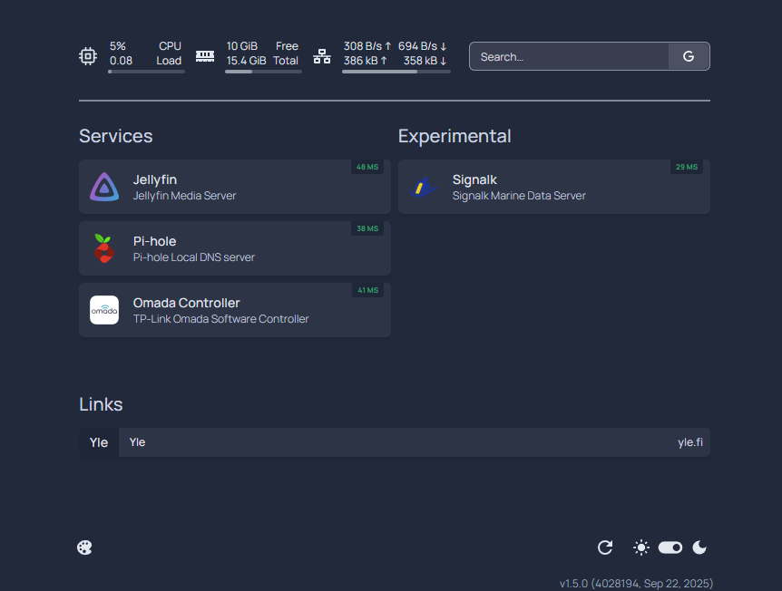

# 🏠Homelab

## 📘 Introduction

This repository contains the configuration of my Kubernetes-based homelab.  
The main purpose of this setup is to learn and practice modern cloud-native technologies and GitOps practices in a production-like environment while also running a few always on applications.

The cluster runs on a single-node [Talos](https://talos.dev/) installation and is fully managed in a GitOps style with [FluxCD](https://fluxcd.io/). All Kubernetes infrastructure and applications are defined declaratively in this repository, with Kustomize overlays for two environments: **Production** (home-prod) and **Development** (home-dev).

**Please note:**
- Sensitive values (IPs, domains, emails) are sanitized before publishing. See [Sanitization](#sanitization) chapter for details.
- This repository is specific to my homelab setup and not a ready-to-use template. If you would like to build something similar, see [Deployment Notes](#deployment-notes).

## ⚙️ Design Principles

The design philosophy and goals for this homelab.

- **GitOps first**: Git is the single source of truth for both infrastructure and application configurations. FluxCD keeps the cluster state in sync with this repository.
- **Modularity**: Separation between infrastructure, applications, and cluster definitions.
- **Environment overlays**: Multiple environments (dev, prod) are handled with Kustomize overlays, avoiding duplication of base manifests.
- **Secrets management**: No secrets in Git. Sensitive data is handled with SOPS and [External Secrets Operator](https://external-secrets.io/) (Azure Key Vault).
- **Production practices**: Adopts patterns suitable for real corporate environments.
- **Avoid vendor lock-in**: Use modular designs and decouple components so switching tools is possible.
- **Kubernetes-native**: Prefer Kubernetes and cloud-native APIs over custom tooling. For example, use [Gateway API](https://gateway-api.sigs.k8s.io/) to define and control inbound traffic centrally.
- **TLS everywhere**: Use real X.509 certificates issued through [cert-manager](https://cert-manager.io/) and terminated by [Kong Gateway](https://konghq.com/).  
- **Bootstrap automation**: New clusters can be bootstrapped quickly with scripts provided in `bootstrap/`.
- **Layered structure**: CRDs, controllers, configs, and applications are separated into their own kustomizations.
- **Single node cluster**: One node is reliable enough for my use case and with GitOps, replacing hardware or rebuilding the cluster is fast enough. A multi-node cluster with distributed storage (like Longhorn) would be nice, but for current needs it would be overkill and expensive.
  

## 🛠️ Technology Stack 

This homelab is built on two main layers: **platform components** that provide the foundation, and **applications** that run on top of it.

### Kubernetes Platform
Core components that make the cluster run and provide the services needed to deploy and manage applications.

| Logo | Name | Description |  
|------|------|-------------| 
|  | [Talos](https://talos.dev) | Immutable, secure-by-default Kubernetes operating system. |
|  | [Flannel](https://github.com/flannel-io/flannel) | CNI plugin |
|  | [FluxCD](https://fluxcd.io/) | GitOps operator keeping cluster state in sync with the repo. |  
|  | [cert-manager](https://cert-manager.io/) | Automated TLS certificate management with Let’s Encrypt (via Cloudflare). |  
|  | [External Secrets Operator](https://external-secrets.io/) | Integrates Kubernetes with external secret stores (Azure Key Vault in this setup). |  
|  | [SOPS](https://getsops.io/) | Encrypts and manages secrets and sensitive configuration data stored in Git. |
|  | [Kong Gateway](https://konghq.com/) | API Gateway configured via Gateway API resources using [Kong Ingress Controller](https://konghq.com/products/kong-ingress-controller).|  
|  | [MetalLB](https://metallb.universe.tf/) | LoadBalancer implementation for bare-metal Kubernetes clusters. |

<!--|  | [K3s](https://k3s.io/) | Lightweight Kubernetes distribution. | -->

### Applications
Core services and experimental workloads deployed in the cluster.
| Name                                          | Description                                       |
| ------------------------------------------------- | ------------------------------------------------- |
| **[Authentik](https://goauthentik.io/)**     | IdP (Identity Provider) and SSO platform (system service).   |
| **[Pi-hole](https://pi-hole.net/)**          | Network-wide ad blocking and local DNS resolver.      |
| **[Homepage](https://gethomepage.dev/)**     | Unified dashboard for services and bookmarks.    |
| **[Jellyfin](https://jellyfin.org/)**        | Media system and streaming server.                           |
| **[Omada Software Controller](https://www.omadanetworks.com/en/business-networking/omada/controller/)** | Software controller for TP-Link SDN.                    |
| **[SignalK](https://signalk.org/)**          | Open marine data platform. |

### 💻 Infrastructure
The homelab runs on a small, efficient setup suitable for a single-node cluster. Current configuration:
| Component | Details 
|-----------|------------------------
| CPU       | Intel N100 (4 cores) 
| Memory    | 16 GB 
| Storage   | Samsung EVO 860 1TB SATA 
| Hypervisor| Ubuntu 24.04 LTS
| Guest OS  | [Talos](https://talos.dev)  

## 🚀 Roadmap

This environment is a work in progress. Below are areas for potential future improvement.

| Area | Idea / Improvement | Status |
| :--- | :--- | :--- |
| **Disaster Recovery** | Implement automated backups (e.g., Velero) for cluster state and PVs. | Planned |
| **Security** | Implement network policies to restrict pod-to-pod traffic (requires replacing Flannel). | Planned |
| **Observability** | Deploy monitoring and alerting (e.g. Prometheus, Grafana). | Planned |

## 📂 Directory Structure

A quick overview of the main directories and their purpose:

### Directories under `kubernetes/`
| Directory         | Purpose |
|------------------|---------|
| `clusters/`       | Environment-specific overlays for `home-prod` and `home-dev`. |
| `infrastructure/` | Cluster infrastructure components (controllers and configs). |
| `apps/`           | Application definitions grouped per app. |
| `bootstrap/`      | Scripts and instructions to bootstrap a cluster from this repo. |

### Directories under `infra`
| Directory      | Purpose |
|----------------|-----------------------------------------------------  |
| `talos/`       | Talos machine configurations for `home-prod` and `home-dev`. |

## 🔒 Sanitization

To make this repository public, a few sensitive values are replaced with safe placeholders:

- Domains → replaced with example.com

- Emails → replaced with user@example.com

- IPs → replaced with 198.51.100.x/24 (TEST-NET-2, for documentation)

Other than these sanitizations, everything reflects the real production environment — including repository structure, manifests, and GitOps workflows.

## 📦 Deployment Notes

This repository is **environment-specific** and cannot be deployed as-is, but it can serve as a reference for building a homelab or GitOps-managed Kubernetes environment. Before using it as a base, review and customize the following components:

- Adjust static `PersistentVolume` definitions
- Update application `PersistentVolumeClaim` storage class references
- Provide your own [Azure Key Vault](https://azure.microsoft.com/en-us/services/key-vault/) and configure credentials
- Provide a valid Cloudflare API token for certificate management
- Generate and configure your own [SOPS](https://github.com/getsops/sops) age key
- Review and adapt secrets, domain names, IP addresses, and certificate configuration

For detailed steps on how **this specific environment** is provisioned and bootstrapped, see:
- [Talos Cluster Setup](./infra/talos/README.md) – how the underlying Talos-based Kubernetes cluster is built
- [FluxCD Bootstrap Guide](./kubernetes/bootstrap/README.md) – how GitOps deployment and reconciliation are initialized

## 📄 License
This project is licensed under the [MIT License](./LICENSE).
